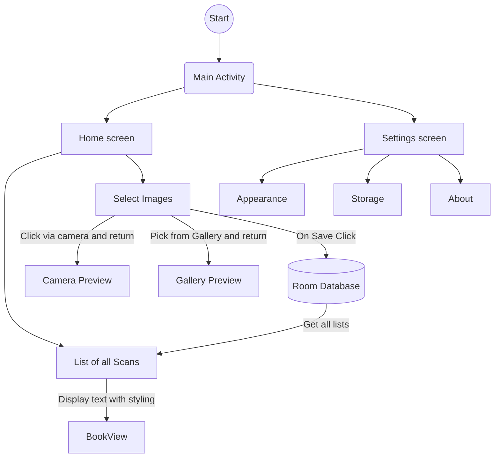

# ReadBud 📚
ReadBud is an Android app used to extract Jargon with its meaning from scanned images of a book or any form of text. It comes in handy when you're a beginner or want to save time by skipping the process of word meaning search on the Internet or any Dictionary

<a href="https://play.google.com/store/apps/details?id=com.binayshaw7777.readbud">

## Purpose of this app 🔥
Extracting Jargon from pages and displaying their meanings without Internet access!

The purpose of this app is very simple and straightforward. To use this app you only need Camera access. Start by clicking picture(s) of your pages from any book and save it. Open your saved scan and read the text extracted via OCR (ML-Kit) and click on the highlighted words (Jargon) to display their meaning on your screen. So simple, isn't it?

## Made With 🛠

- [Kotlin](https://developer.android.com/kotlin/first) - First class and official programming language for Android development.
- [Compose](https://developer.android.com/jetpack/composegclid=CjwKCAjwzJmlBhBBEiwAEJyLu2qleC59of9xNRzh_5ePAPseeZSVPlexxReaIobsofKr32Eo3Ob_cxoCCUcQAvD_BwE&gclsrc=aw.ds) Build better apps faster with Jetpack Compose
- [Coroutines](https://kotlinlang.org/docs/coroutines-overview.html) - For asynchronous calls and tasks to utilize threads.
- [Android Architecture Components](https://developer.android.com/topic/architecture) - Collection of libraries that help you design testable, and maintainable apps.
  - [ViewModel](https://developer.android.com/topic/libraries/architecture/viewmodel) - Stores UI-related data that isn't destroyed on UI changes.
  - [Room](https://developer.android.com/training/data-storage/room) - Room is an Android library which is an ORM that wraps Android's native SQLite database
  - [LiveData](https://developer.android.com/topic/libraries/architecture/livedata) - LiveData was used to save and store values for ViewModel calls and response to method calls.
  - [StateFlow and SharedFlow](https://developer.android.com/kotlin/flow/stateflow-and-sharedflow#:~:text=StateFlow%20is%20a%20state%2Dholder,property%20of%20the%20MutableStateFlow%20class.) -StateFlow and SharedFlow are Flow APIs that enable flows to optimally emit state updates and emit values to multiple consumers.
- [Material 3](https://m3.material.io/develop/android/jetpack-compose) - Android's modern toolkit for building native UI. Support is available for Material Design 3.
- [CameraX](https://developer.android.com/jetpack/androidx/releases/camera) - To enable the feature of QR Code scanning.
- [Coil](https://coil-kt.github.io/coil/compose/) - To set or place URL, and Bitmaps as Images on the screen.
  
  

<br>

## Architecture 👷‍♂️


This app uses [MVVM(Model View View-Model)](https://developer.android.com/topic/architecture#recommended-app-arch) architecture.

## Flow of the app 🗺



## Launched and featured on
<a href="https://play.google.com/store/apps/details?id=com.binayshaw7777.readbud">

## Connect with me:
[](https://github.com/binayshaw7777)
[](https://linkedin.com/in/binayshaw7777)

## 📝 License

```
MIT License

Copyright (c) 2023 Binay Shaw

Permission is hereby granted, free of charge, to any person obtaining a copy
of this software and associated documentation files (the "Software"), to deal
in the Software without restriction, including without limitation the rights
to use, copy, modify, merge, publish, distribute, sublicense, and/or sell
copies of the Software, and to permit persons to whom the Software is
furnished to do so, subject to the following conditions:

The above copyright notice and this permission notice shall be included in all
copies or substantial portions of the Software.

THE SOFTWARE IS PROVIDED "AS IS", WITHOUT WARRANTY OF ANY KIND, EXPRESS OR
IMPLIED, INCLUDING BUT NOT LIMITED TO THE WARRANTIES OF MERCHANTABILITY,
FITNESS FOR A PARTICULAR PURPOSE AND NONINFRINGEMENT. IN NO EVENT SHALL THE
AUTHORS OR COPYRIGHT HOLDERS BE LIABLE FOR ANY CLAIM, DAMAGES OR OTHER
LIABILITY, WHETHER IN AN ACTION OF CONTRACT, TORT OR OTHERWISE, ARISING FROM,
OUT OF OR IN CONNECTION WITH THE SOFTWARE OR THE USE OR OTHER DEALINGS IN THE
SOFTWARE.
```


